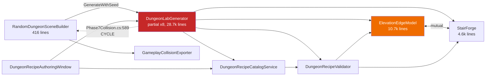
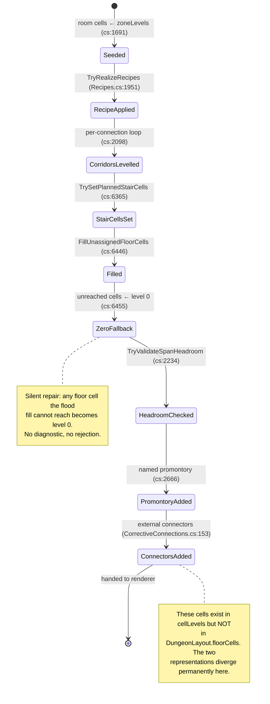
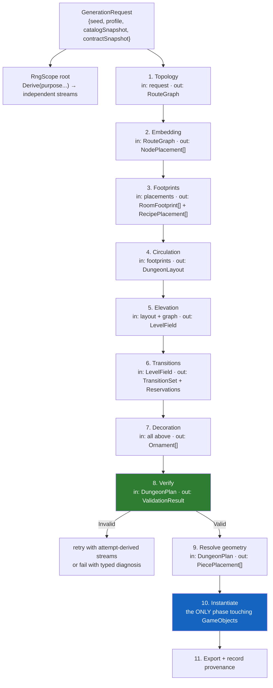
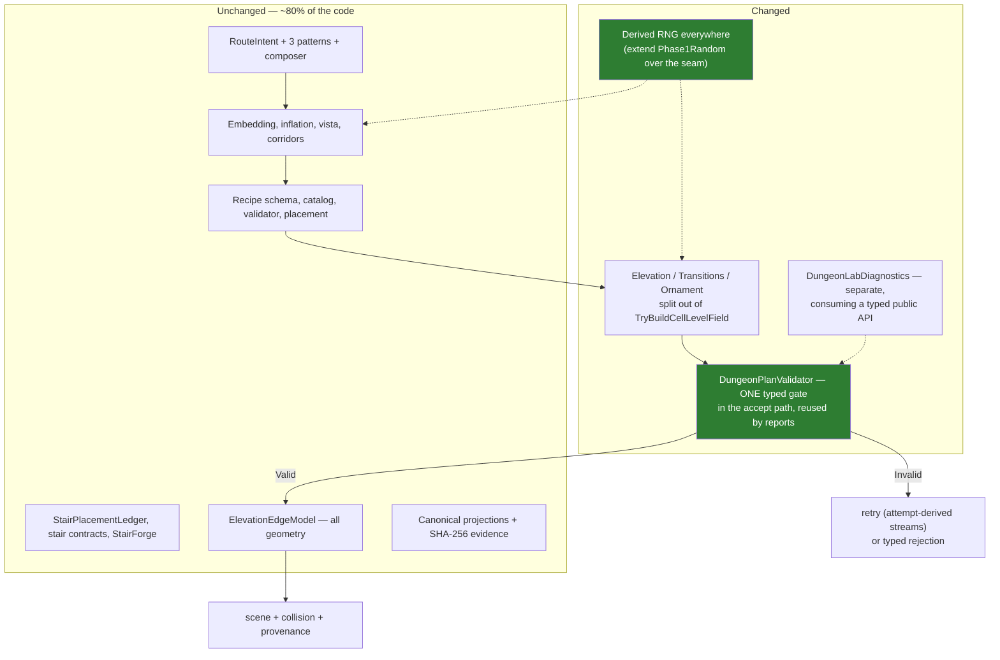

# Dungeon generator architectural review

Date: 2026-07-25
Scope: `Assets/Arena/Editor/Dungeons/RandomDungeon` (24 files, ~47.6k lines), `Assets/Arena/Tests/Editor/DungeonLab*` (25 files, ~4.4k lines), `docs/dungeon-builder/*`, generated data under `Assets/Arena/Content/Settings/Dungeons/RandomDungeon`.
Method: end-to-end reconstruction from `RandomDungeonSceneBuilder.RebuildWithSeed` through to the saved scene and exported collision payloads. No production code was modified.

Labels used throughout: **[Fact]** verified in the repository with a citation; **[Interpretation]** my reading of why something is the way it is; **[Assumption]** something I could not verify and am taking as given.

---

## 1. Executive summary

**The generator is organized around the right concepts.** Route intent → spatial embedding → canonical layout → elevation/transition plan → renderer → collision export is the correct decomposition for these requirements, and it is the decomposition the code actually implements. The recipe schema ([DungeonRecipeAsset.cs](Assets/Arena/Editor/Dungeons/RandomDungeon/DungeonRecipeAsset.cs)) is genuinely well-designed data-driven authoring. The diagnostic and hashing infrastructure is stronger than most production procedural generators I have seen. The documentation set is unusually good and mostly accurate.

**I do not recommend a rewrite.** The expensive, hard-won knowledge in this system — measured prefab contracts, stair geometry, abyss support, wall/railing/corner grammar — lives in `ElevationEdgeModel` and in JSON contract data, and it is fundamentally sound. Replacing it would destroy value.

**What has gone wrong is narrower and more fixable than "wrong abstractions".** Four things:

1. **A phase boundary collapsed.** [`TryBuildCellLevelField`](Assets/Arena/Editor/Dungeons/RandomDungeon/DungeonLabGenerator.cs#L1657-L2317) is 660 lines that absorbed six distinct responsibilities — cell levelling, seam strips, corridor transition solving, aerial bridges, void fill, and four late "corrective" passes. It is where nearly all interesting mutation happens, and it has no internal boundaries. Every new feature over several weeks has been appended here because there was nowhere else to put it.

2. **Validation is bifurcated, and the strong half gates nothing.** Twelve hard checks live in [`BuildPhase0ValidationSummary`](Assets/Arena/Editor/Dungeons/RandomDungeon/DungeonLabGenerator.Batch.cs#L4495), which is called from exactly one place — the batch report builder ([Batch.cs:3865](Assets/Arena/Editor/Dungeons/RandomDungeon/DungeonLabGenerator.Batch.cs#L3865)). The generation path never runs them, and four renderer sites skip work with a logged error and `continue`. A dungeon that logs `validation=FAIL` is still saved and exported. **This is a latent hazard, not a demonstrated ongoing defect — see the correction in §7.2.**

3. **Randomness is half-migrated.** The route half uses named, derived, per-purpose streams ([`Phase1Random`](Assets/Arena/Editor/Dungeons/RandomDungeon/DungeonLabGenerator.RouteFirstPilot.cs#L2774)) — this is exactly the right pattern. The tier half still threads one shared sequential `System.Random` through two nested retry loops, so *how many times an attempt failed* determines which rooms get enclosed, which loops appear, and which stair prefabs are picked. The correct architecture already exists in the codebase; it just was not carried across the seam.

4. **The evidence layer fused into the production class.** ~14.9k lines of phase-archaeology (Batch, Phase7, Phase7Collision, Phase7Gallery, CorrectiveValidation) are `partial` members of `DungeonLabGenerator`, reachable only by reflection from 24 test files that parse ad-hoc `key=value` strings. There is no public API boundary. Renaming a private method breaks the test suite at runtime, not compile time.

**Interpretation:** the system does not need a stronger central model — it has one. It needs the phases that were poured into one basin separated back out, one validation gate moved from the report path into the accept path, and the modern randomness pattern extended over the seam. That is roughly 2–4 focused work items, not a redesign.

Severity summary:

| # | Finding | Severity |
|---|---------|----------|
| C1 | Production path never runs hard validation; `validation=FAIL` dungeons ship | **Critical** |
| C2 | Shared RNG threaded through retries — retry count changes output | **Critical** |
| H1 | `TryBuildCellLevelField` is a collapsed phase boundary (660 lines, 6 responsibilities) | High |
| H2 | Two divergent representations of "where the floor is" | High |
| H3 | Late passes mutate state after the gate that validated it | High |
| H4 | No API boundary; 24 test files reflect into private methods | High |
| H5 | `RouteIntent` — the semantic model — dies before rendering, survives in a static | High |
| M1–M8 | Hash-preservation vestiges, display strings in canonical data, vestigial retry loop, duplicated formulas, dependency cycle, generation writing tracked assets, unversioned contract inputs, overload chain | Medium |
| L1–L4 | Duplicate type names, unstable sort, triplicated hash mixer, duplicate 5 MB collision payloads | Low |

---

## 2. Current system mental model

### 2.1 What the generator is trying to produce

**[Fact]** One deterministic Unity scene (`Assets/Arena/Content/Scenes/OpenWorld/RandomDungeon.unity`) plus matching client/server collision payloads, from one integer seed. Per [COHERENT_FLOORPLAN_PLAN.md §1](docs/dungeon-builder/COHERENT_FLOORPLAN_PLAN.md), the design target is a floor that "reads as a designed place": a legible main journey with branches and loops, a destination, a planned vista, and authored recipe content interleaved with generic construction.

**[Fact]** Generation is editor-time only and deliberately so — a client-only runtime layout would disagree with the authoritative server collision ([README.md:46](docs/dungeon-builder/README.md)).

### 2.2 Core entities, and whether they are explicit

| Concept | Representation | Explicit? |
|---|---|---|
| Generation request | `int seed` + `DungeonGenerationSettings` + active recipe catalog | Partial — no request object; seed and profile travel separately, profile via `static CurrentGenerationSettings` |
| Macro-topology pattern | `RoutePatternKind` enum + three `Build*RouteIntent` factories | Explicit |
| Route graph | `RouteIntent` (nodes, traversal edges, vista, elevation policy, recipe slots) | **Explicit and good** |
| Route node | `RouteNodeIntent` (id, role, beat, orders, elevation, slot) | Explicit |
| Connection | `RouteTraversalIntent` (topology) and `RoomConnection` (spatial) | Explicit, two levels — correct |
| Vista / visibility | `RouteVistaIntent` + reserved cell set | Explicit |
| Room | `RoomFootprint` (multi-rect parts + cell set) | Explicit |
| Cell | `Vector2Int` on a 4u grid | Implicit — a bare `Vector2Int`, no cell type |
| Spatial footprint | `HashSet<Vector2Int>` throughout | Implicit |
| Elevation | `int` levels (1u), plus 4u/8u "major" grammar as `const` | Implicit — grammar lives in scattered constants |
| Layout | `DungeonLayout` (floorCells, rooms, connections, roomZones) | Explicit |
| Elevation plan | `TieredLevelPlan` (cellLevels, transitions, + 9 display strings) | Explicit but polluted |
| Reservation | `StairPlacementLedger` (footprint/landing/mouth sets) | **Explicit and good** |
| Recipe | `DungeonRecipeAsset` → `RecipePlacement` → `RecipeResolution` | **Explicit and good** |
| Generation attempt | Loop counters only — no attempt object | **Implicit** |
| Constraint | Inline `if` + `rejectionReason` strings, plus stable reason codes | Partial |
| Validation result | `JObject` in the report path; `bool + string` in the accept path | **Two incompatible forms** |
| Prefab | Asset path strings + measured JSON contracts | Explicit |

**Interpretation:** the *topological* and *authored-content* layers are modelled properly. The *spatial* layer is modelled as raw `Vector2Int` collections, and the *process* layer (attempt, constraint, validation result, failure) is barely modelled at all. That asymmetry is the source of most of the pain: you cannot pass a failure around, so failures become strings; you cannot pass an attempt around, so attempt state becomes statics and shared RNG.

---

## 3. The actual generation pipeline

### 3.1 Execution order

```mermaid
flowchart TD
    A["RandomDungeonSceneBuilder.RebuildWithSeed(seed)<br/>RandomDungeonSceneBuilder.cs:104"] --> B["EditorSceneManager.NewScene (empty)"]
    B --> C["DungeonLabGenerator.GenerateWithSeed<br/>DungeonLabGenerator.cs:193"]
    C --> D["LoadActiveGenerationSettings(profileId)<br/>→ static CurrentGenerationSettings"]
    D --> E["GenerateRandomDungeonLayout(new Random(seed))<br/>cs:276"]

    E --> F["TryBuildAcceptedPlan — outer loop x2<br/>cs:949"]

    subgraph OUTER["layout attempt (max 2)"]
      F --> G["TryBuildRouteFirstDungeonLayout<br/>RouteFirstPilot.cs:320"]
      G --> G1["load active recipe catalog"]
      G1 --> G2["SelectRoutePattern(seed) → 1 of 3"]
      G2 --> G3["Build*RouteIntent (composer)"]
      G3 --> G4["TryResolveRequiredRecipeSlots (3 slots)"]
      G4 --> G5["TryValidateRouteIntent + rhythm"]
      G5 --> G6["TryEmbedRoute → node centers"]
      G6 --> G7["TryInflateProcessionalRooms → footprints"]
      G7 --> G8["TryReserveProcessionalVista"]
      G8 --> G9["TryPlanNamedVistaPromontory"]
      G9 --> G10["TryPlaceRouteRecipes → RecipePlacement[]"]
      G10 --> G11["TryConnectProcessionalRooms → corridors"]
      G11 --> G12["density / connectivity precondition"]
      G12 --> G13["ChooseRoomZoneSplits → DungeonLayout"]

      G13 --> H["TryBuildTieredLevelPlan — inner loop x32<br/>cs:1059"]

      subgraph INNER["tier attempt (max 32)"]
        H --> H1["RoomZoneContext.Build"]
        H1 --> H2["TryAssignRoomLevels (deterministic copy of intent)"]
        H2 --> H3["AddLevelSafeLoopConnections ← shared RNG"]
        H3 --> H4["density gates + connected delta validation"]
        H4 --> I["TryBuildCellLevelField ← shared RNG<br/>cs:1657 (660 lines)"]
        I --> H5["level count / transition delta / port graph<br/>/ route requirement validation"]
      end
    end

    H5 --> J["TieredLevelPlan assembled"]
    J --> K["StairForge.AppendSynthesisLog → writes tracked JSON"]
    K --> L["TryBuildRoomBoundaryContext ← shared RNG<br/>cs:3157"]
    L --> M["ElevationEdgeModel.BuildLevelField<br/>ElevationEdgeModel.cs:174"]
    M --> N["PlaceDaisShowpieces"]
    N --> O["log GENERATION_SUMMARY validation=PASS/FAIL"]
    O --> P["CenterDungeonSpawn / MarkDungeonCollision"]
    P --> Q["SaveScene + AddSceneToBuildSettings"]
    Q --> R["GameplayCollisionExporter → Resources + server/src/world_data"]

    style I fill:#c62828,color:#fff
    style O fill:#ef6c00,color:#fff
```



### 3.2 Inside the collapsed phase

**[Fact]** `TryBuildCellLevelField` executes these in order, all mutating the same `cellLevels` dictionary, `transitions` list and `plannedStairLedger`:

| Step | Lines | Responsibility |
|---|---|---|
| 1 | 1687–1696 | Seed cell levels from zone levels |
| 2 | 1698–1748 | Build ledger reservations (vista, promontory) + doorway cell set |
| 3 | 1751–1769 | `TryRealizeRecipes` — apply recipe zones/transitions |
| 4 | 1778–1820 | Seam strips for every 1u zone boundary |
| 5 | 1822–2213 | **Per-connection transition solving** — 3-tier fallback: reviewed contract → synthesized stair → stairwell tower; plus external-span deck handling, corridor levelling, step strips |
| 6 | 2222–2231 | `AddAerialBridges` (new loop edges, shared RNG) |
| 7 | 2233 | `FillUnassignedFloorCells` (flood fill) |
| 8 | 2234–2237 | **`TryValidateSpanHeadroom` — the headroom gate** |
| 9 | 2241–2248 | `SweepIntraRoom1uDrops` (adds transitions) |
| 10 | 2253–2260 | `TryResolveNamedVistaPromontory` — **writes new cellLevels (cs:2666)** |
| 11 | 2264–2276 | `TryValidateResolvedRecipes` |
| 12 | 2282–2295 | `TryResolveExternalConnectorPromontories` — **adds new cells (CorrectiveConnections.cs:153)** |

Steps 9, 10 and 12 all run *after* the headroom gate at step 8, and steps 10 and 12 add floor cells that step 8 never saw.

**Interpretation:** this ordering is not accidental — each step was appended when its feature was built, and each comment explains why it must run last ("runs after every other level-field feature", "the final plan mutation"). Three different features each believe they are last. That is the signature of a missing phase boundary rather than a missing check.

---

## 4. Responsibility and ownership map



| Subsystem | Owns | Reads | Mutates | Called by | Overlap risk |
|---|---|---|---|---|---|
| `RandomDungeonSceneBuilder` | Scene lifecycle, camera/lighting, build settings, collision export trigger | Generated root hierarchy, camera template scene | Scene, `EditorBuildSettings`, model importers (`isReadable`), server JSON | Menus, batch CI, Phase7 | **Cycle with generator** |
| `DungeonLabGenerator` (core, `.cs`) | Accept loop, tier planning, cell-level field, stair transition solving, boundary context | Profile asset, stair contracts JSON, step library, package inventory | `cellLevels`, `transitions`, ledger, `static CurrentGenerationSettings` | Scene builder, tests (reflection) | Owns too much — see H1 |
| `.RouteFirstPilot` | Route intent construction, embedding, room inflation, vista, corridors | Profile spatial settings, recipe catalog | `phase1Last*` statics | Core | Clean — best-structured file |
| `.RouteGraphComposition` | Graph composition primitives (spine/branch/rejoin/publish) | — | Its own builders | RouteFirstPilot | Clean |
| `.Recipes` | Recipe slot resolution, placement, realization, validation | Recipe assets, route intent | `cellLevels`, `transitions`, ledger, showpieces | Core, RouteFirstPilot | Realization mutates core's state |
| `.CorrectiveConnections` | External connector promontories | `cellLevels`, ledger, transitions | **`cellLevels`** | Core (step 12) | Post-gate mutation |
| `.Batch`, `.Phase7*`, `.CorrectiveValidation` | Reports, hashes, sweeps, galleries, collision parity | Everything | Temp scenes/assets, report JSON | Menus, tests (reflection) | **14.9k lines fused into production class** |
| `ElevationEdgeModel` | All prefab geometry: floors, walls, corners, railings, stairs, gateways, piers, abyss | Contract JSON, package inventory, prefabs | Scene GameObjects | Core | Sound; overload chain is messy |
| `StairForge` | Stair synthesis, forged contracts, review queue | Step piece library | **`synthesized_stair_log.json` (tracked asset)** | Core, EEM | Writes during generation |
| `DungeonRecipeCatalogService` | Active catalog + digest + preview scope | Recipe assets | `static previewCatalog` | Core, window | Clean |
| `DungeonRecipeValidator` | Layered recipe contract validation | Recipe asset | — | Catalog service, window | **Clean, typed, well-modelled** |

**Interpretation:** `DungeonRecipeValidator` is the one subsystem in this codebase that models validation properly — layered, typed findings with codes and messages, an explicit result object. That model already exists here. It is not used for dungeon-level validation, which is where it is most needed.

---

## 5. State and data-flow map

### 5.1 Where `cellLevels` is mutated



### 5.2 The divergence (H2)

**[Fact]** `TryResolveExternalConnectorPromontories` calls `cellLevels.Add(...)` for pier cells ([CorrectiveConnections.cs:153](Assets/Arena/Editor/Dungeons/RandomDungeon/DungeonLabGenerator.CorrectiveConnections.cs#L153)) but never adds them to `layout.floorCells`. `ElevationEdgeModel.BuildLevelField` consumes only `cellLevels`, so it renders them. Everything computed from `floorCells` — `CalculateFloorFillPercent`, `IsConnected`, `BuildLayoutGraphSummary`, the canonical layout hash — describes a dungeon that is missing 1–4 piers.

**Interpretation:** this is benign today because the piers are decorative stubs. It is a structural hazard because it establishes the precedent that `cellLevels` is the real floor and `floorCells` is a stale prefix. Any future feature that adds walkable space late inherits the same split.

### 5.3 Mutable statics

**[Fact]** Generation-scoped state held in statics:

| Static | File | Risk |
|---|---|---|
| `CurrentGenerationSettings` | cs:100 | Set by every entry point; effectively a global argument |
| `phase1LastRouteIntent`, `phase1LastNodeCenters`, `phase1LastVistaCells`, `phase1Last*` (7 fields) | RouteFirstPilot.cs:58–67 | The semantic model survives only here (H5) |
| `activeReviewedStairPlacementGeometryCache` | cs:1057 (`[ThreadStatic]`) | Correctly scoped with try/finally |
| `previewCatalog`, `previewRecipeId` | DungeonRecipeCatalogService.cs:38 | Scoped by `IDisposable`, correct |
| `synthesisFailureCache`, `stairwellFailureCache`, `deckDesignCache` | StairForge.cs:1060, 1244, 1321 | Cross-generation caches; keys look complete |
| `Phase0CatalogDigestCache` | Batch.cs | Keyed on settings digest only — will not notice a contract JSON edit within one editor session |
| `phase7ActiveOutlierTiming` | Phase7.cs:66 | Diagnostic only |

---

## 6. Randomness and determinism analysis

### 6.1 Two regimes

**[Fact]** There is no `UnityEngine.Random` anywhere in the generator — all randomness is `System.Random`. That is the right call and it is enforced.

**Regime A — derived streams (correct).** [`Phase1Random(seed, layoutAttempt, stableId, purpose)`](Assets/Arena/Editor/Dungeons/RandomDungeon/DungeonLabGenerator.RouteFirstPilot.cs#L2774) FNV-mixes seed + planner version + attempt + a stable identity + a purpose. Room shape for node `threshold` on attempt 2 is independent of every other draw in the system. Also used by `RecipeSelectionRandom` (excluding attempt, deliberately), `TryTransformCoarseEmbedding`, external connector hashing, and per-gap stair synthesis (`dungeonSeed ^ StableHash("synth:...")`).

**Regime B — one shared sequential stream (the problem).** `new System.Random(seed)` at [cs:202](Assets/Arena/Editor/Dungeons/RandomDungeon/DungeonLabGenerator.cs#L202) is threaded into `TryBuildAcceptedPlan` → `TryBuildTieredLevelPlan` → every one of the 32 tier attempts → `AddLevelSafeLoopConnections`, `TryChooseReviewedActiveStairTransition`, `AddAerialBridges` — and finally into `TryBuildRoomBoundaryContext` after the plan is accepted.

### 6.2 Consequences (C2)

**[Fact]** Consumers of the shared stream, in order:

| Consumer | Draws | Variable count? |
|---|---|---|
| `BuildCorridorPath` in loop connections (cs:886) | 1 per candidate path *attempted*, including rejected ones | **Yes** — depends on room count and geometry |
| `ChooseStairTransitionCandidate` (cs:5564, 5571) | 2 per multi-rise connection | **Yes** |
| `AddAerialBridges` (cs:4118) | 1 per placed bridge | **Yes** |
| `ChooseEnclosedRooms` (cs:3519–3535) | roomCount + up to 2 | Fixed given room count |

Because failed tier attempts consume from the same stream, **the choice of which rooms are visually enclosed depends on how many tier attempts failed first.** `ChooseEnclosedRooms` is reached at [cs:3176](Assets/Arena/Editor/Dungeons/RandomDungeon/DungeonLabGenerator.cs#L3176) via `TryBuildRoomBoundaryContext`, called once after acceptance — but with a stream whose position is the sum of every draw made by every failed attempt.

**[Fact]** The same seed reproduces the same dungeon *today* (verified by the project's own two-run comparisons — `CURRENT_STATUS.md` records identical result hashes across independent runs). The problem is not present-tense irreproducibility; it is that **the mapping from seed to dungeon is a function of every draw count anywhere upstream**. Adding one `random.Next()` to loop-candidate evaluation reshuffles enclosed rooms, stair prefab choices and bridges across every seed.

**Interpretation:** this is why the project developed the hash-lock ritual. Locked hashes are a *symptom* of Regime B, not a solution to it. Under Regime A, an unrelated change provably cannot perturb an unrelated stream, and hash locking becomes unnecessary for the streams that were not touched. Your own 2026-07-22 ruling — that the locked-hash ceremony applies only to identity-preserving refactors — is the right policy, and extending Regime A is what makes that policy cheap to honour.

### 6.3 A concrete instance baked into production (M1)

**[Fact]** [`SampleConfiguredRoomDimension`](Assets/Arena/Editor/Dungeons/RandomDungeon/DungeonLabGenerator.RouteFirstPilot.cs#L2378-L2400):

```csharp
// Reuse the already-consumed binary baseline roll for any two-value
// range. That keeps the spacious profile byte-for-byte compatible
// without creating a second room-size random stream.
if (hasBaselineRoll && maximum - minimum == 1)
    return minimum + baselineValue - baselineMinimum;
return minimum + random.Next(maximum - minimum + 1);
```

A hardcoded shadow config (`BaselineRoomSizeRangeForRole`) is rolled first, always; whether its draw is *reused* or a *second* draw is taken depends on the width of the configured range. **Configuration changes the number of RNG draws.** The shadow config exists solely to preserve a hash from an earlier phase.

### 6.4 Other determinism inputs

**[Fact]** A seed's output is a function of: seed, generation profile asset, `package_inventory.json`, `stair_proof_contracts.json`, `forged_stair_contracts.json`, `stair_connector_settings.json`, `step_piece_library.json`, and the active recipe catalog digest. `Phase0CatalogDigest` ([Batch.cs:6836](Assets/Arena/Editor/Dungeons/RandomDungeon/DungeonLabGenerator.Batch.cs#L6836)) hashes all of them — **but only in the report path.** The production scene records only the seed (`CreateSceneMetadata`, a GameObject named `Random Dungeon Seed {n}`). Given a saved scene, you cannot tell which contract set produced it.

**[Fact]** `forged_stair_contracts.json` grows over time via a human review workflow: generation synthesizes a stair → `StairForge.AppendSynthesisLog` queues it → a human marks it reviewed → it enters the pool → **every seed's output changes**. This is a legitimate design, but it means "deterministic for a seed" is only true relative to a moving content baseline that the scene does not record.

**[Fact]** Iteration-order hygiene is good: `FillUnassignedFloorCells` explicitly sorts its flood-fill seeds with the comment "Dictionary key order is not contractually stable" (cs:6424–6427); `SortedCells`/`CompareCells` are used at every renderer handoff. **[Low, L2]** `candidates.Sort((l,r) => l.distance.CompareTo(r.distance))` at cs:1379 is `List<T>.Sort` (unstable introsort) on a comparator with frequent ties — deterministic for a given runtime, not contractually stable across .NET versions.

---

## 7. Invariants and validation analysis

| Invariant | Established | Checked | Can later stages violate it? | Architecture support |
|---|---|---|---|---|
| Floor mask connected | `TryConnectProcessionalRooms` | `IsConnected` in route builder (RouteFirstPilot.cs:459); `layoutConnectivity` in report | Yes — external connectors add cells outside `floorCells` | Weak |
| Rooms do not overlap | `OverlapsPlacedRoom` during inflation | Same place only | No | Good |
| Bottom-to-top route exists | Route intent by construction | `portGraph.IsGloballyConnected` (cs:1264) **in accept path** | No | **Good** |
| Every connection has a valid transition | Per-connection solve, 3-tier fallback | `TryValidateTransitionLevelDeltas` (cs:1252) in accept path | No | Good |
| Route elevation grammar (4u/8u) | `TryAssignRoomLevels` | Inline at cs:1561–1585 and cs:1843 | No | **Good** |
| Recipes placed atomically with bound ports | `TryPlaceRecipe` | `TryValidateResolvedRecipes` (cs:2264) in accept path | No | **Good** |
| Headroom under bridges ≥ 3u | Deck-level computation at cs:2062 | `TryValidateSpanHeadroom` at cs:2234 | **Yes** — steps 9/10/12 run after | **Fragile (H3)** |
| Every generated dungeon passes hard validation | — | `BuildPhase0ValidationSummary` — **report path only** | n/a | **Absent in production (C1)** |
| Renderer consumes a valid plan and does not repair | Documented invariant | Partly — some renderer failures throw, some log and continue | **Yes** | **Violated (C1)** |
| Prefab placement matches abstract layout | `ElevationEdgeModel` contracts | `stats.rejected` counter | Yes — soft rejections leave holes | Weak |

### 7.1 C1 in detail — the production path has no gate

**[Fact]** Two classes of renderer failure exist in `ElevationEdgeModel`:

- **Hard**: `throw` (e.g. [ElevationEdgeModel.cs:545](Assets/Arena/Editor/Dungeons/RandomDungeon/ElevationEdgeModel.cs#L545), [:562](Assets/Arena/Editor/Dungeons/RandomDungeon/ElevationEdgeModel.cs#L562), [:692](Assets/Arena/Editor/Dungeons/RandomDungeon/ElevationEdgeModel.cs#L692), [:1635](Assets/Arena/Editor/Dungeons/RandomDungeon/ElevationEdgeModel.cs#L1635)) → caught at [DungeonLabGenerator.cs:342](Assets/Arena/Editor/Dungeons/RandomDungeon/DungeonLabGenerator.cs#L342) → `LogError` → `return` → no root → `RandomDungeonSceneBuilder` throws. Fails loudly. Correct.
- **Soft**: `Debug.LogError` ending in the literal words `"Continuing without aborting the build."`, then `continue`. **Four sites**, and each has a `throw` immediately beside it for the same condition — the difference is only whether `transition.stairPrefabPath` is non-empty:

| Line | Function | Condition skipped |
|---|---|---|
| [537–543](Assets/Arena/Editor/Dungeons/RandomDungeon/ElevationEdgeModel.cs#L537) | stair placement loop | transition references a missing floor cell (`stats.rejected++`) |
| [553–560](Assets/Arena/Editor/Dungeons/RandomDungeon/ElevationEdgeModel.cs#L553) | stair placement loop | transition has no level difference (`stats.rejected++`) |
| [1629–1633](Assets/Arena/Editor/Dungeons/RandomDungeon/ElevationEdgeModel.cs#L1629) | `BuildTransitionKeys` | transition references a missing level cell |
| [1677–1683](Assets/Arena/Editor/Dungeons/RandomDungeon/ElevationEdgeModel.cs#L1677) | `BuildTransitionKeys` | transition is not straight-through |

The two `BuildTransitionKeys` sites are the more dangerous pair: that function computes which wall faces become openings. Skipping a transition there does not increment `stats.rejected` at all, so it is invisible even to the `validation=FAIL` log line — and it can leave a wall across a stair mouth, or an opening with no stair behind it.

**Interpretation:** the paired throw/continue at each site reads as "a named prefab means an author cared, so don't nuke the whole build" — a reasonable instinct when the renderer was being developed interactively. It is the wrong default now that the output is committed to the server.

**[Fact]** After `BuildLevelField` returns, [DungeonLabGenerator.cs:361–403](Assets/Arena/Editor/Dungeons/RandomDungeon/DungeonLabGenerator.cs#L361-L403) does not inspect `report.rejected`. It appears only inside two `Debug.Log` strings, the second ending `validation={(report.rejected == 0 ? "PASS" : "FAIL")}`. Control then returns to `RandomDungeonSceneBuilder`, which centers the dungeon, marks collision, **saves the scene** (line 145), adds it to build settings, and **exports collision to `server/src/world_data`** (line 156).

**Consequence:** a dungeon with a missing staircase — i.e. potentially an unreachable tier — is committed to the playtest scene and to the authoritative server collision, and the only signal is a `Debug.Log` line reading `validation=FAIL` among ~30 other fields.

**[Fact]** Separately, the twelve-check hard validation (`FLOOR_CONNECTIVITY`, `ROOM_GRAPH_CONNECTIVITY`, `TRANSITION_CONTRACT`, `VERTICAL_TRAVERSAL`, `BOTTOM_TO_TOP_TRAVERSAL`, `ROUTE_REQUIREMENTS`, `RECIPES`, `NAMED_PROMONTORY`, `EXTERNAL_CONNECTOR_PROMONTORY`, `POST_PLAN_HEADROOM_CLEARANCE`, `BOUNDARY_CONTEXT`, `RENDERER_INPUT`) never runs in production. Roughly half are duplicated inline in the accept path; `POST_PLAN_HEADROOM_CLEARANCE`, `RENDERER_INPUT` and `BOUNDARY_CONTEXT` are not.

### 7.2 Correction — withdrawing the "1.5% of seeds" claim

> **Correction (2026-07-25, after checking the test result XMLs).** My first draft claimed "~1.5% of seeds produce a plan the project's own strongest check rejects." **That claim was wrong and is withdrawn.** It came from the 197/200 figure in the phase log, which is explicitly attributed to the Phase 0 baseline of a *since-deleted* room-first path. I have no evidence that any seed fails hard validation today, and the one live signal points the other way — see §7.3.
>
> C1 is unchanged as a **structural** finding: the gate is not wired into the generation path, and four renderer sites skip work silently. But it is a **latent hazard, not a demonstrated ongoing defect.** It is still worth closing — a scene regenerated several times a day with no human validation step is exactly the situation where a silent skip goes unnoticed — but the urgency is "close the hole", not "you are shipping broken dungeons".

### 7.3 The three failing tests are stale locks, not correctness failures

**[Fact]** Extracted from `Logs/recipe_slice_b_all_dungeon_lab.xml` and `Logs/dungeon-stair-invariant-validation.xml`:

| Test | Actual failure | Correctness content |
|---|---|---|
| `FixedAndRegressionProductionSeeds_AreHardValidAndPreservePlans` | `prechangePlanHash` mismatch — expected `3d0bf9c1…`, got `f765fd63…` | **None.** The assertion order in [DungeonLabCorrectiveConnectionTests.cs:60–67](Assets/Arena/Tests/Editor/DungeonLabCorrectiveConnectionTests.cs#L60-L67) checks `accepted`, `hardValid`, `count == desired`, `externalValid` *before* the hash. NUnit throws on first failure, so reaching the hash assertion **proves those four passed** for seed 2026072100 |
| `TierRetryOptimization_PreservesTheExactOutlierSeedResult` | Hardcoded hash mismatch — expected `f5886c96…`, got `227ae8de…` | None |
| `FinalDeletionLedger_HasNoRandomDaisProducerOrLegacyRendererScaffolding` | `Does.Contain("StairForge.TryGetBackedShowpieceDesign")` — the symbol moved ([DungeonLabPhase7ProductionHardeningTests.cs:110](Assets/Arena/Tests/Editor/DungeonLabPhase7ProductionHardeningTests.cs#L110)) | None — it is a source-text assertion that 23 retired symbols are absent and 2 present |

**Interpretation, and this is the important part:** these three failures are **C2's bill arriving.** Hash locks fail because the shared RNG makes every change global — you cannot touch anything without invalidating every stored hash, so locks rot, and rotted locks train you to ignore red tests. Deleting the locks treats the symptom; deriving the RNG (2.2) removes the cause. Both are worth doing, in that order.

**[Fact]** The live evidence available to me is therefore: 5 fixed seeds, all `hardValid == True`. I could not run a fresh sweep — the Unity editor holds `Temp/UnityLockfile`, so batchmode on the main project is unavailable.

### 7.4 H3 — validation before mutation

**[Fact]** `TryValidateSpanHeadroom` runs at cs:2234. `SweepIntraRoom1uDrops` (adds transitions), `TryResolveNamedVistaPromontory` (writes `cellLevels[cell] = sourceLevel`, cs:2666) and `TryResolveExternalConnectorPromontories` (adds cells) all run after it.

**[Fact]** The post-plan re-check (`TryValidateAcceptedPlanHeadroom`, [Batch.cs:4875](Assets/Arena/Editor/Dungeons/RandomDungeon/DungeonLabGenerator.Batch.cs#L4875)) **reimplements the deck-level formula** — `Mathf.FloorToInt(Mathf.Lerp(min, max, deckDistance / spanLength))` — identically to cs:2062–2077 **[M4]**. Two copies of one geometric rule, in two files, one of which is the only thing that catches the other's staleness.

**[Fact]** `FillUnassignedFloorCells` ends with a silent repair: any floor cell the flood fill cannot reach gets `cellLevels[cell] = 0` ([cs:6451–6457](Assets/Arena/Editor/Dungeons/RandomDungeon/DungeonLabGenerator.cs#L6451-L6457)). No counter, no diagnostic, no rejection. If it ever fires on a real cell, it silently creates an arbitrary elevation cliff.

---

## 8. Debugging and testing analysis

### 8.1 Can the system explain a bad generation?

| Question | Answerable? | How |
|---|---|---|
| What abstract layout existed before prefabs? | **Yes, excellent** | `BuildCanonicalLayoutProjection` + `BuildPhase1RouteIntentProjection` + per-node placement, all hashed |
| Which constraint failed? | **Yes** | Stable reason codes (`ROUTE_INTENT_INVALID`, `RECIPE_SELECTION`, `ROUTE_TRANSITION_RESERVATION`, …) + `Phase0RejectionCode` normalisation |
| Why did this seed require retries? | **Partly** | `rejectionHistogram` is captured, but digits are regex-collapsed to `#` (cs:1022), so *which* room/level failed is lost in the aggregate |
| Why was this room placed here? | **Partly** | Node center + envelope are in `routePlacement`; the inflation attempt that won is not recorded, only the total attempt count |
| Why was this candidate rejected? | **No, for stairs** | `stairCandidateCounts` records how many candidates were *offered* per group; nothing records why the others were filtered. Recipes do this properly — per-candidate reason codes |
| Which stage introduced this defect? | **Partly** | Phase 7 stage timers exist (`BeginPhase7OutlierStage`) but measure *time*, not state deltas. There is no per-stage plan snapshot |
| Why did two runs of one seed differ? | **Weak** | Only via full-report diff; no draw-index or stream-position record |

**Interpretation:** debuggability is strong at the *boundaries* (route intent in, canonical plan out) and weak in the *middle* (the 660-line phase). This is precisely the shape you would predict from the collapsed phase boundary: you can see what went in and what came out, but not what the six intermediate steps did.

### 8.2 Testability

**[Fact]** Planning is pure data and *does* run headless — `LogPlanningWarning` (cs:1001) exists specifically because "plan building is pure data and also runs in headless validation hosts where Unity's native logger is unavailable". That is a real architectural strength: **the whole pipeline up to `BuildLevelField` needs no GameObjects.**

**[Fact, H4]** But that strength is not exposed. All 24 dungeon test files reach the generator like this:

```csharp
private static readonly Type GeneratorType = AppDomain.CurrentDomain
    .Load("Assembly-CSharp-Editor")
    .GetType("DungeonLab.Editor.DungeonLabGenerator", throwOnError: true)!;
...
MethodInfo method = GeneratorType.GetMethod("BuildRouteCharacterizationSnapshot",
    BindingFlags.NonPublic | BindingFlags.Static);
string text = (string)method.Invoke(null, new object[] { seed });
Dictionary<string, string> report = ParseSnapshot(text);   // parses key=value lines
```

46 `BindingFlags.NonPublic` usages across the suite. The generator's test surface is ~40 private `BuildXxxSnapshot(int seed)` methods returning ad-hoc text, one family per historical phase (`BuildPhase5RecipeContractSnapshot`, `BuildPhase6dRouteRhythmSnapshot`, `BuildDensityAdjacencySlice5Snapshot`, `BuildSliceDRecipePoolProofSnapshot`, …).

Consequences:
- Renaming or removing a private method breaks tests at **runtime**, not compile time.
- The tests assert on parsed strings, so refactoring output formatting is a breaking change.
- ~7k lines of `Batch.cs` exist only to serve this reflection surface, and it grows by one snapshot builder per phase.

| Capability | Present? |
|---|---|
| Deterministic unit tests without scenes | Yes (via reflection) |
| Invariant tests | Yes — `BuildPhase0ValidationSummary` is exactly this, but unreachable except through the report |
| Property/fuzz across many seeds | Yes — 50/200/2000-seed sweeps exist and are good |
| Snapshotting abstract layouts | Yes — canonical projections + SHA-256, genuinely strong |
| Isolated testing of placement rules | **No** — placement rules are inline in a 660-line method |
| Regression tests for known bad seeds | Yes — `2026072100..2026072149` fixed ranges |

---

## 9. Architectural strengths worth preserving

These are not consolation prizes; they are the reason a rewrite would be a mistake.

1. **Route-first is real, not aspirational.** `RouteIntent` genuinely exists before any coordinates, and `TryAssignRoomLevels` is now a deterministic copy of declared node elevations rather than a search. The semantic layer drives the spatial layer. That is the hard part, and it is done.
2. **The recipe schema.** `DungeonRecipeAsset` with explicit zones/ports/transitions/motifs/variations, `DungeonRecipeValidator` with layered typed findings, catalog digests, and `disabledForGeneration`. This is the best-designed component in the system and should be the template for the rest.
3. **The stair placement ledger.** `StairPlacementLedger` with distinct footprint/landing/mouth semantics ("landings may share other landings but never a footprint") is a real reservation model, not ad-hoc collision checks.
4. **Canonical projections and hashing.** `BuildCanonicalLayoutProjection` / `BuildCanonicalTieredLevelPlanProjection` / `Phase0CatalogDigest` give you replayable, diffable, content-addressed evidence. Most generators have nothing like this.
5. **Derived RNG streams in the route half.** `Phase1Random(seed, attempt, nodeId, purpose)` is textbook-correct. It just needs to be extended, not invented.
6. **Data-driven geometry contracts.** No semantics inferred from prefab names, bounds, or raycasts — enforced by `PROJECT_INVARIANTS.md` and honoured in code.
7. **Headless-capable planning.** No GameObjects until `BuildLevelField`.
8. **The documentation set.** `GLOSSARY.md` in particular is better than most commercial projects manage, and it accurately distinguishes role/beat, room/recipe, eligibility/selection.

---

## 10. Architectural concerns, ranked

### Critical

**C1 — Production generation has no acceptance gate.**
Files: [DungeonLabGenerator.cs:328–404](Assets/Arena/Editor/Dungeons/RandomDungeon/DungeonLabGenerator.cs#L328-L404), [Batch.cs:4495](Assets/Arena/Editor/Dungeons/RandomDungeon/DungeonLabGenerator.Batch.cs#L4495) (single call site at 3865), four soft-continue sites in [ElevationEdgeModel.cs](Assets/Arena/Editor/Dungeons/RandomDungeon/ElevationEdgeModel.cs#L537) (537, 553, 1629, 1677 — two of which are invisible even to `stats.rejected`), [RandomDungeonSceneBuilder.cs:119–158](Assets/Arena/Editor/Dungeons/RandomDungeon/RandomDungeonSceneBuilder.cs#L119-L158).
The strongest validation the project owns runs only when building reports, and the renderer's soft rejections do not stop the scene from being saved and exported. Documented invariant "the renderer does not repair plans; rendering either consumes valid canonical plan data or rejects it" is not enforced.

**C2 — Shared RNG stream through nested retry loops.**
Files: [cs:202](Assets/Arena/Editor/Dungeons/RandomDungeon/DungeonLabGenerator.cs#L202), [cs:949–997](Assets/Arena/Editor/Dungeons/RandomDungeon/DungeonLabGenerator.cs#L949-L997), [cs:1121–1140](Assets/Arena/Editor/Dungeons/RandomDungeon/DungeonLabGenerator.cs#L1121-L1140), [cs:3176](Assets/Arena/Editor/Dungeons/RandomDungeon/DungeonLabGenerator.cs#L3176), [cs:5564](Assets/Arena/Editor/Dungeons/RandomDungeon/DungeonLabGenerator.cs#L5564), [cs:1389](Assets/Arena/Editor/Dungeons/RandomDungeon/DungeonLabGenerator.cs#L1389).
Retry count and rejected-candidate counts leak into unrelated downstream decisions. This is the root cause of the hash-lock ceremony and the reason every change requires a 50-seed proof.

### High

**H1 — `TryBuildCellLevelField` is a collapsed phase boundary.** 660 lines, six responsibilities, three mutable containers, twelve sequential steps, three of which each claim to be "last". Any new elevation, transition or decoration feature has nowhere else to go.

**H2 — Two representations of the floor.** `DungeonLayout.floorCells` vs `TieredLevelPlan.cellLevels` diverge at CorrectiveConnections.cs:153.

**H3 — Repair passes run after their own validation.** Headroom gate at cs:2234 precedes three mutating passes; the only backstop is a duplicated formula in the report path. Plus the silent `level = 0` fallback at cs:6455.

**H4 — No API boundary; reflection-based test seam.** 24 test files, 46 `NonPublic` bindings, ~40 private snapshot builders, ~14.9k lines of evidence code `partial`-fused into the production class.

**H5 — The semantic model does not survive the pipeline.** `RouteIntent` is consumed and discarded; `TieredLevelPlan` receives derived resolutions but not node identity. The intent survives only in `static phase1LastRouteIntent` for report building. Nothing downstream — renderer, collision, scene — can answer "which route node is this room?", which blocks gameplay features (spawn by beat, encounter pacing by role) that the vocabulary already anticipates.

### Medium

- **M1** Hash-preservation vestiges in production: `BaselineRoomSizeRangeForRole` + `SampleConfiguredRoomDimension` (RouteFirstPilot.cs:2364–2400). Config width changes RNG draw counts.
- **M2** `TieredLevelPlan` (cs:8016) carries 9 pre-formatted display strings (`transitionSummary`, `stairUsageSummary`, `topologySummary`, `placementClassSummary`, `stairCandidateSummary`, `portGraphSummary`, `roomsPerTierSummary`, `synthesizedStairSummary`, `archetypeName`) as canonical plan data. Log formatting is baked into the data model, and `stairCandidateSummary` is string-appended by four unrelated features (cs:2297–2312).
- **M3** `LevelAssignmentAttempts = 32` names a stage that is now fully deterministic (`TryAssignRoomLevels` copies intent). The loop exists only to re-roll the shared stream — a retry compensating for weak construction rules.
- **M4** Deck-level formula duplicated (cs:2062 vs Batch.cs:4903).
- **M5** Dependency cycle: `RandomDungeonSceneBuilder` → `DungeonLabGenerator.GenerateWithSeed`; `DungeonLabGenerator.Phase7Collision` → `RandomDungeonSceneBuilder.RebuildWithSeedForValidation` (Phase7Collision.cs:589, 676, 1120).
- **M6** Generation writes tracked project assets: `StairForge.AppendSynthesisLog` (StairForge.cs:2648) rewrites an 872 KB checked-in JSON with `DateTime.UtcNow` stamps as a side effect of every generate.
- **M7** Contract inputs (`forged_stair_contracts.json` etc.) change generation output over time and are hashed only in the report path; the saved scene records only the seed.
- **M8** `ElevationEdgeModel.BuildLevelField` has five overloads forming a parameter-accretion chain (3 → 4 → 5 → 6 → 7 optional inputs), each added by a feature.

### Low

- **L1** Two unrelated `WallEdge` types (cs:8124 = cell+direction; ElevationEdgeModel.cs:9547 = edge+levels+partition).
- **L2** Unstable `List.Sort` on a tie-heavy comparator (cs:1379).
- **L3** `MixExternalConnectorHash` (CorrectiveConnections.cs:391) is a byte-identical copy of `MixPhase1Hash` (RouteFirstPilot.cs:2792); `StairForge.StableHash` is a third variant.
- **L4** `random_dungeon.collision.shared.json` and `random_dungeon.query_collision.shared.json` are byte-identical 5 MB files (verified: same MD5), regenerated on every rebuild. **Note for the LOS contract in `CLAUDE.md`:** the dungeon is exported with `reuseMovementCollisionForQueries: true`, so unlike seeded arenas, its query geometry *is* its (deliberately oversized) movement geometry. That is a defensible choice, but it is the opposite of the stated project rule and is worth recording explicitly rather than leaving as an emergent property of an exporter flag.

---

## 11. Clean-slate comparison architecture

If this were designed today with current requirements known, I would organize it as below. **The phase list is nearly identical to what exists** — the differences are in boundaries, state ownership and failure representation, not in concepts.



**Central data model.** One immutable `DungeonPlan` record built by accretion — each phase takes the previous plan and returns a new one with one more section filled. `RouteGraph` is carried all the way through, not discarded. Cells are a `CellId` value type, not a bare `Vector2Int`. No display strings anywhere in the plan.

**Randomness.** One `RngScope` per request; every consumer calls `scope.Derive("elevation", "connection", edgeId)`. No stream is ever passed sequentially between phases. Retry derives `scope.Derive("attempt", n)`. **Consequence: a change to phase 6 provably cannot alter phase 3's output**, which removes the need for hash locking on untouched streams.

**Failure.** A typed `GenerationFailure { code, phase, subject, detail, candidatesConsidered[] }`, not a formatted string. Rejection histograms aggregate on `code` without regex digit-stripping.

**Validation.** One `Validate(DungeonPlan)` returning `ValidationResult` (the `DungeonRecipeValidator` model, generalized). Called in exactly one place, before geometry resolution. Retry and reporting both consume the same result.

**Where decisions happen:** topology in phase 1; spatial layout in 2–4; elevation in 5–6; geometry/prefab selection in 9; GameObjects only in 10.

### 11.1 How this differs from today, and why it matters

| Dimension | Today | Clean-slate | Why it matters |
|---|---|---|---|
| Phases 5–7 | Fused in one 660-line method | Three phases with typed I/O | Every new feature currently lands in the same basin |
| Validation | Inline `bool`+`string` in accept path; separate 12-check `JObject` in report path | One `ValidationResult`, one call site, consumed by both | C1 disappears structurally |
| Randomness | Shared stream + derived streams | Derived only | C2 disappears; hash locking becomes optional |
| Failure | Strings, regex-normalized | Typed record | Diagnosis without log archaeology |
| Semantic layer | Discarded after layout | Carried to instantiation | Unlocks spawn-by-beat, encounter pacing |
| Floor truth | `floorCells` + `cellLevels` | One `LevelField` | H2 disappears |
| Diagnostics | 14.9k lines fused into the generator | Pure functions over `DungeonPlan`, separate assembly | Tests bind to types, not reflection |
| Attempt | Loop counters + statics | `GenerationAttempt` value | Attempts become inspectable and comparable |

**Honest assessment:** items 1, 2, 3 and 6 in that table are worth doing. Items 4, 5, 7 and 8 are worth doing opportunistically. **None of them require replacing `ElevationEdgeModel`, `StairForge`, the recipe system, the contract data, or the route planner** — which is ~80% of the code.

---

## 12. Incremental migration options

### Level 0 — Delete the closed-phase archive (do this first)

Added 2026-07-25 after you confirmed the phases are closed and that the status log was confusing LLM assistants. **This is now the highest-value item on the list**, and it is subtraction rather than construction.

| # | Change | Problem solved | Affects | Benefit | Risk | Difficulty | Output changes? | Verify by |
|---|---|---|---|---|---|---|---|---|
| **R0.1** | Delete `DungeonLabGenerator.Phase7.cs`, `.Phase7Collision.cs`, `.Phase7Gallery.cs`, `.CorrectiveValidation.cs` (~3.8k lines) and the phase/slice-specific snapshot builders in `.Batch.cs` (~5k of its 7k lines) | H4, M5 — closed-phase evidence fused into the production class | Generator partials | Production class roughly halves; the `RandomDungeonSceneBuilder` cycle breaks with it | **Low** — none of it is reachable from `GenerateWithSeed`; it is menu- and reflection-only | 1 day | **No** | Compile; `Arena > Dungeons > Rebuild Random Dungeon` still works; `Tools > Dungeon Lab > Batch Validate (50)` still works |
| **R0.2** | Delete the ~20 phase/slice test files (`DungeonLabPhase3*`–`Phase7*`, `DungeonLabDensityAdjacencySlice1-6*`, `DungeonLabCorrective*`), including all three stale-hash failures | The suite's red baseline | Tests | Suite goes green; stale locks stop training you to ignore failures | Low | 2 h | No | Suite green |
| **R0.3** | Keep and consolidate the genuinely reusable fixtures: characterization (determinism), stair boundary compatibility, recipe workflow, route-graph composition. Retarget them at the 2.6 API when it exists | Preserves real coverage | Tests | ~5 meaningful test files instead of 25 | Low | 4 h | No | Retained tests pass |
| **R0.4** | Archive `CURRENT_STATUS.md`'s phase log and replace it with a short current-state page | The file confuses LLM assistants and humans returning to the work | Docs | Context cost per session drops sharply | None | 30 min | No | **Done 2026-07-25** — archived to `docs/archive/2026-07-dungeon-phase-log/` |
| R0.5 | Consider archiving `COHERENT_FLOORPLAN_PLAN.md`, `DENSITY_ADJACENCY_PLAN.md`, `RECIPE_POOL_SELECTION_PLAN.md` alongside it; keep `PROJECT_INVARIANTS.md`, `GLOSSARY.md`, `ROOM_AUTHORING_GUIDE_CURRENT.md`, `RECIPE_AUTHORING_WORKFLOW.md`, `stair_forge_design.md` | Same | Docs | Reading path shrinks from 12 docs to 6 | None | 15 min | No | `README.md` reading order updated |

**Interpretation:** roughly 9k lines of code and 120 KB of prose exist to prove that finished work was finished. That proof has been recorded; the machinery that produced it has no remaining consumer. For a solo developer working with LLM assistance, this archive is not neutral — every assistant that reads the repo pays for it in context and is actively misled by phase vocabulary that no longer describes the system.

### Level 1 — Preserve and clarify

| # | Change | Problem solved | Affects | Benefit | Risk | Difficulty | Output changes? | Verify by |
|---|---|---|---|---|---|---|---|---|
| 1.1 | Rename `LevelAssignmentAttempts` → `TierPlacementAttempts`; comment that it re-rolls the shared stream | M3 — misleading name hides C2 | 1 const | Makes C2 visible | None | 10 min | No | Compile |
| 1.2 | Split `TryBuildCellLevelField` into 6 private methods by existing comment blocks, same file, same order, no signature changes | H1 readability | cs:1657–2317 | Each step becomes nameable/greppable | Low — pure extraction | 1–2 h | **No** | 50-seed hash parity |
| 1.3 | Add a `[Fact]`-style provenance component to the generated scene recording seed + `Phase0CatalogDigest` + planner versions | M7 | `CreateSceneMetadata` | A saved scene becomes self-describing | None | 1 h | No (scene metadata only) | Open scene, read values |
| 1.4 | Add counters + a warning for the `cellLevels[cell] = 0` fallback and for `report.rejected > 0` | H3, C1 visibility | cs:6455, cs:376 | Silent repairs become loud | None | 30 min | No | Run a sweep, confirm counters are 0 |
| 1.5 | Delete `MixExternalConnectorHash`, call `MixPhase1Hash` | L3 | CorrectiveConnections.cs | −20 lines | None (identical) | 15 min | No | Hash parity |
| 1.6 | Document in `PROJECT_INVARIANTS.md` that the dungeon exports query collision == movement collision | L4 / CLAUDE.md contract | Docs | Removes a latent contradiction | None | 15 min | No | Review |

### Level 2 — Incremental structural improvement

| # | Change | Problem solved | Affects | Benefit | Risk | Difficulty | Output changes? | Verify by |
|---|---|---|---|---|---|---|---|---|
| **2.1** | **Move hard validation into the accept path.** Extract the 12 checks from `BuildPhase0ValidationSummary` into a `DungeonPlanValidator` returning a typed result; call it at the end of `TryBuildTieredLevelPlanAttempt`; treat failure as a retry reason; have the report call the same function. Make `report.rejected > 0` throw. | **C1** | Batch.cs, cs:1145, cs:328 | The system's strongest guarantee becomes enforced | **Medium — ~1.5% of seeds currently fail and would now retry or reject.** That is the point, but it will change which seeds are accepted | 1–2 days | **Yes, for currently-invalid seeds only** | Run 200 seeds pre/post; every seed that changes must have had `passed:false` before |
| **2.2** | **Give the tier planner derived streams.** Replace the shared `System.Random` with `Phase1Random(seed, layoutAttempt, tierAttempt, purpose)` at each of the 4 consumption sites (loop paths, stair choice, aerial bridges, enclosed rooms). | **C2** | cs:1389, 3176, 4118, 5564 | Retry count and unrelated edits stop perturbing output; hash locking becomes unnecessary for untouched streams | Low technically; **all hashes change once** | 1 day | **Yes, once — a deliberate one-time rebaseline** | Two independent runs identical; then verify a no-op edit to loop-candidate evaluation leaves stair choices unchanged (impossible today) |
| 2.3 | **Delete the hash-preservation shadow config.** Remove `BaselineRoomSizeRangeForRole`, simplify `SampleConfiguredRoomDimension` to `min + random.Next(max-min+1)`. | M1 | RouteFirstPilot.cs:2364–2400 | Config stops changing RNG draw counts | Low | 2 h | **Yes** — fold into 2.2's rebaseline | 50-seed sweep + sentinel eyeball |
| 2.4 | **Move the late passes before the headroom gate**, or re-run the gate after them using the single shared formula. Delete the duplicate in Batch.cs. | H3, M4 | cs:2234–2295, Batch.cs:4875 | Gate actually guards the final state | Low | 4 h | Possibly — some currently-shipping seeds may now reject | 200-seed sweep; expect ≤3 newly-rejected seeds matching the known headroom failures |
| 2.5 | **Add external connector cells to `floorCells`** (or introduce a single `LevelField` owning both). | H2 | CorrectiveConnections.cs:153 | One floor truth | Low | 4 h | Layout hash changes (fill %, graph summary) | Confirm renderer output byte-identical; only report metrics move |
| 2.6 | **Introduce a small typed public API** (`DungeonPlanBuilder.Build(seed, profile) → DungeonPlanResult`) and port the test suite off reflection onto it, one file at a time. | H4 | New file + 24 test files | Refactors become compile-checked | Low | 3–5 days, parallelizable | No | Tests pass; grep `BindingFlags.NonPublic` trends to 0 |
| 2.7 | **Carry `RouteIntent` into `TieredLevelPlan`** (one field) and remove the `phase1Last*` statics from the report path. | H5 | cs:8016, RouteFirstPilot.cs:58 | Semantic layer survives; unlocks role/beat-driven gameplay | Low | 1 day | No | Report content identical, sourced from the plan |
| 2.8 | **Move the evidence layer to its own file group/assembly** (`DungeonLabDiagnostics`), consuming the 2.6 API instead of being `partial`. | H4, M5 | Batch/Phase7*/CorrectiveValidation (14.9k lines) | Production class shrinks ~50%; cycle breaks | Medium — large mechanical move | 3–5 days | No | Compile + full suite |
| 2.9 | Strip display strings from `TieredLevelPlan`; compute them in a `PlanSummary` formatter. | M2 | cs:8016 + ~12 call sites | Data model stops carrying its own log line | Low | 1 day | No (identical strings, computed later) | Log output diff empty |

### Level 3 — Fundamental redesign

| # | Change | Problem solved | Affects | Benefit | Risk | Difficulty | Output changes? | Verify by |
|---|---|---|---|---|---|---|---|---|
| 3.1 | Immutable accreting `DungeonPlan` record replacing `DungeonLayout` + `TieredLevelPlan` + loose out-params | H1, H2, H5 structurally | Whole generator | Phases become provably pure | High | 3–4 weeks | Ideally no | Full hash parity at every phase boundary |
| 3.2 | `RngScope` with hierarchical derivation replacing all ad-hoc hashing | C2, L3 structurally | Everywhere | Provable stream independence | Medium | 1–2 weeks | Yes, once | Independence property test |
| 3.3 | Extract planning into a plain C# assembly with no `UnityEditor` reference; Unity layer becomes a thin adapter | Testability | Whole generator | Sub-second test runs, no editor lock | High | 4–6 weeks | No | Suite runs outside Unity |
| 3.4 | Replace the three hand-written `Build*RouteIntent` factories with data-driven pattern assets composing `RouteGraphComposer` ops | Pattern growth cost | RouteFirstPilot | Adding a 4th pattern becomes authoring, not coding | Medium | 2–3 weeks | Yes for existing patterns unless carefully mirrored | Reproduce all 3 existing patterns byte-identically first |

**My assessment of Level 3:** 3.2 is worth doing and is mostly subsumed by 2.2. 3.1 is worth doing *only after* 2.1/2.4/2.5 have collapsed the divergent state — at that point it is a smaller job than it looks today. 3.3 and 3.4 are speculative; **do not do them now.** 3.4 in particular would be premature — three patterns is not enough evidence to design the abstraction, and `COHERENT_FLOORPLAN_PLAN.md` decision 11 ("abstractions are earned by a working slice") already says so.

---

## 13. Recommended target architecture

**Keep the pipeline you have. Fix four things about it.**



Target invariants after this work:

1. **No dungeon reaches the scene without passing `DungeonPlanValidator`.** Renderer soft-rejections abort the rebuild.
2. **Every random decision draws from a stream derived from `(seed, attempt, stable identity, purpose)`.** No sequential sharing.
3. **`cellLevels` and `floorCells` are one thing**, or one is provably derived from the other.
4. **Validation happens once, after all mutation, on the final plan.**
5. **The evidence layer consumes a public API** and cannot be broken by renaming a private method.
6. **`RouteIntent` is part of the plan**, available at instantiation.

---

## 14. Suggested implementation sequence

Ordered so each step de-risks the next, and so the two behaviour-changing steps are adjacent and rebaselined together.

> **Revised 2026-07-25** after your answers: there is no production/release concept, the scene is regenerated several times a day, all phases are closed, and the status log was actively costing you context. That moves deletion to the front and softens the framing of everything downstream.

**Step 0 — Delete the archive (Level 0, ~2 days).**
R0.1–R0.5. Subtraction only, no behaviour change. Ends with a green test suite, a production class about half its current size, the `RandomDungeonSceneBuilder` cycle gone, and a docs folder a fresh session can read in full. **Do this before anything else** — every subsequent step is cheaper to reason about afterwards, and every LLM session you run in the meantime pays the archive's context cost.

**Step 1 — Baseline (½ day).**
With the editor free, run `Tools > Dungeon Lab > Batch Validate (200 Fixed Seeds)` and record how many seeds have `validation.passed == false`. **This number is currently unknown** — see the correction in §7.2. It defines step 3's blast radius. If it is 0, step 3 is a pure safety net; if it is non-zero, those seeds are the ones whose output will change.

**Step 2 — Level 1 items 1.1–1.6 (1 day).**
Pure clarification. No output change. Ends with `TryBuildCellLevelField` split into six named methods and silent repairs instrumented.

**Step 3 — Recommendation 2.1: the validation gate (1–2 days).**
Extract `DungeonPlanValidator`, call it in `TryBuildTieredLevelPlanAttempt`, make renderer skips fatal. **Gate:** every seed whose output changed must have had `passed:false` in the step 1 baseline. If any seed with `passed:true` changes, stop — the extraction is not faithful.

**Step 4 — Recommendation 2.4: fix the gate's position (½ day).**
Now that the gate exists in one place, move the late passes before it (or re-validate after) and delete the duplicated deck formula.

**Step 5 — Recommendations 2.2 + 2.3 together: the RNG rebaseline (1–2 days).**
Do these in one commit and accept one deliberate hash change. Cheap now, because step 0 deleted the stale locks that would otherwise all need re-baselining. **Gate:** two independent runs identical, and a deliberate no-op perturbation to loop-candidate evaluation leaves stair topology histograms unchanged across 50 seeds — a property that is impossible today and is the proof that C2 is fixed.

**Step 6 — Recommendation 2.5: unify the floor representation (½ day).**
Cheap once the gate is in place.

**Step 7 — Recommendation 2.6: the typed API (2–3 days).**
Smaller than originally estimated, because step 0 deleted most of what would have needed porting. 2.8 (moving the diagnostics layer out) is largely subsumed by R0.1.

**Step 8 — Recommendations 2.7 + 2.9 (1–2 days).**
Carry `RouteIntent` into the plan; strip display strings out of it. **You answered "I don't know, sure?" on runtime route semantics — so treat 2.7 as opportunistic.** Do it because it deletes the `phase1Last*` statics, not because of a gameplay feature you have not decided to build. If a spawn-by-beat or pacing-by-role feature never materialises, this step still pays for itself by removing mutable global state from the report path.

**On `LevelAssignmentAttempts = 32` (you deferred to me):** do not delete it blind. Add an attempt-count histogram to the batch report in step 2 — it is about ten lines. **[Interpretation]** I expect p95 to be 1–2 attempts based on the archived evidence (`spacious attempts are 1:50`, `dense 1:44, 2:6` over 50 seeds), which would mean the loop's 32 iterations exist entirely to absorb rare failures. If that holds, after step 5 you can drop it to ~4 and delete a large slice of C2's blast radius outright. Measure first; it is one number and it settles the question.

**Then reassess.** After steps 0–8 the production class should be roughly half its current size, with one validation gate and provably independent randomness. **My expectation [Interpretation]:** Level 3 item 3.1 will then look like a 1-week job rather than a 4-week one, and 3.3/3.4 will still not be worth doing.

---

## 15. Open questions and assumptions

**All five questions were answered on 2026-07-25. Resolutions:**

| # | Answer | What changed in this review |
|---|---|---|
| 1 | No production/release concept; the scene is regenerated **several times a day** | C1 stays Critical structurally, but reframed as latent hazard (§7.2). High regeneration frequency + no human validation step is why it is still worth closing |
| 2 | Unknown; deferred to me | **Settled from the test XMLs (§7.3): all three are stale hash/source-text locks. None indicates a broken dungeon.** My "~1.5% of seeds" claim is withdrawn |
| 3 | Phases are closed; `CURRENT_STATUS.md` should be a clean slate — "the file confuses llms" | **Created Level 0 (§12) and made it the first implementation step.** Phase log archived to `docs/archive/2026-07-dungeon-phase-log/`; a short current-state page replaces it |
| 4 | "I don't know, sure?" | Deliberately **not** promoted. 2.7 stays opportunistic, justified by deleting statics rather than by a hypothetical feature |
| 5 | Deferred to me | Answered with a measurement rather than a guess: instrument the attempt histogram in step 2, then decide (§14) |

**Remaining open — I could not resolve these myself:**

- **What is the current hard-valid rate?** The Unity editor holds `Temp/UnityLockfile`, so I could not run a sweep. Step 1 of §14 exists to get this number. Until then it is genuinely unknown, not assumed-bad.
- **Visual quality.** Out of scope for a structural review; the blinded curated gallery is the right tool and I did not run it.

<details>
<summary>The original questions with your answers inline, kept verbatim</summary>

1. **How often do you actually regenerate the production scene?** If it is rare and always eyeballed, C1's severity drops from Critical to High. If CI or a batch job can rebuild and export without a human looking, it stays Critical. i don't really have a "production" system, i'm vibe-coding a video game and have no concept of production, but i regenerate the dungeon several times per day. 
2. **Are the three long-standing failing tests (`FixedAndRegressionProductionSeeds_AreHardValidAndPreservePlans`, `FinalDeletionLedger_HasNoRandomDaisProducerOrLegacyRendererScaffolding`, `TierRetryOptimization_PreservesTheExactOutlierSeedResult`) known-and-accepted, or unexplained?** The first one is the direct symptom of C1 and I have treated it as real. i don't know. again, just vibe-coding. i will defer to your judgement. 
3. **Is the `phase7`/`corrective`/`slice` evidence still load-bearing?** ~14.9k lines encode completed phase gates. If those phases are closed and their conclusions recorded in `CURRENT_STATUS.md`, most of that code is an archive, not a test suite — and deleting it is a bigger, cheaper win than any refactor I have listed. I did not recommend deletion because I cannot tell which sweeps you still run. those phases are closed. i want current_status to be a clean slate/removed if possible. i'm not currently implementing any large phased plan and the file confuses llms. 
4. **Do you want route semantics at runtime** (spawn by beat, encounter pacing by role, "the culmination room")? If yes, recommendation 2.7 moves up in priority substantially. If no, it is optional. i don't know, sure?
5. **Is `LevelAssignmentAttempts = 32` empirically necessary?** Instrumenting the attempt distribution would tell you whether tier planning genuinely needs 32 re-rolls or whether p99 is 2 — which would make the loop, and much of C2's blast radius, removable outright. no, i trust your judgement.

</details>

**Assumptions I made:**

- **[Assumption]** The Unity editor's asset import order does not affect generation. `AssetDatabase.FindAssets` results are sorted (`Array.Sort(guids, StringComparer.Ordinal)` at ElevationEdgeModel.cs:991) at the one place I checked, and the recipe catalog is an explicit ordered list, so I believe this holds — but I did not audit every `FindAssets` call.
- ~~**[Assumption]** The 197/200 hard-valid figure still reflects current behaviour.~~ **Withdrawn** — it is attributed to a since-deleted room-first path and I am no longer treating it as evidence about today. Step 1 of §14 replaces it with a measurement.
- **[Assumption]** `Assets/Arena/Content/Scenes/OpenWorld/RandomDungeon.unity` is regenerated rather than hand-edited, so overwriting it is always safe.
- **[Assumption]** Floating-point determinism across machines is not currently a requirement (generation is single-machine, editor-time). `Mathf.Lerp`/`Mathf.FloorToInt` in the deck-level formula and `float` weights in `ChooseStairTransitionCandidate` would be a cross-machine reproducibility concern if that ever changes.

**What I could not evaluate:** visual quality. Everything above is about structure, guarantees and reproducibility. The blinded curated gallery (`Phase 7/Generate Blinded Curated Gallery`) is the right tool for the quality question and I have not run it.

---

## 16. Bottom line

The generator is **not** a collection of overlapping subsystems built around wrong concepts. It is a correctly-conceived route-first pipeline in which one phase boundary collapsed, one validation gate ended up on the wrong side of the production/reporting split, and one half of a randomness migration was never finished. Those three things account for most of the friction, and each is a bounded, verifiable fix.

The strongest argument against a rewrite is not risk-aversion — it is that the parts a rewrite would be motivated by (the recipe system, the ledger, the canonical evidence, the derived RNG pattern) **already exist here and are good.** The work is to extend them across the seam, not to replace them.

**Revised ordering after your answers (2026-07-25).** If you do only three things, in this order:

1. **Delete the closed-phase archive (R0).** ~9k lines of code and 120 KB of prose that exist to prove finished work was finished. It is subtraction, it carries almost no risk, it turns the test suite green by removing three stale locks, and — because you are working with LLM assistance — it stops every future session from paying context for vocabulary that no longer describes the system. This was not in my first draft's top two; your answer to Q3 moved it to first.
2. **Make hard validation gate generation (2.1).** You regenerate several times a day with no human validation step. The gate exists, fully written, in the reporting path. Wiring it in is a small job.
3. **Derive the tier planner's randomness (2.2).** The three stale hash locks are this problem's bill arriving: shared sequential RNG makes every change global, so locks rot and red tests become background noise. Fixing the RNG is what stops that recurring.

One correction I owe you from the first draft: I wrote that a known-failing test was "the direct symptom of C1" and that ~1.5% of seeds ship broken. **Both were wrong.** All three failing tests are stale locks with no correctness content, and I have no evidence that any seed currently fails hard validation. C1 is a real hole in the architecture, but it is a hole that has not visibly bitten you yet.
